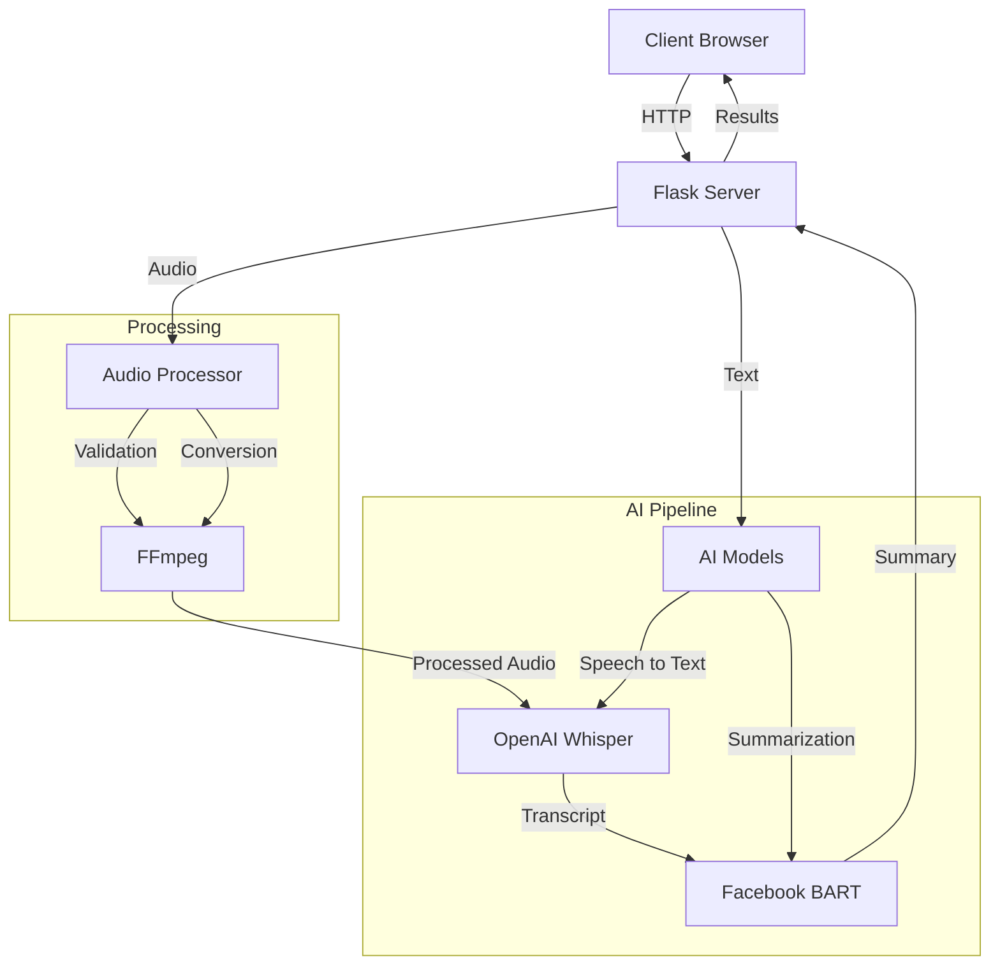
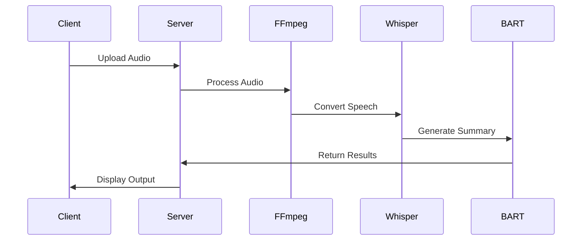
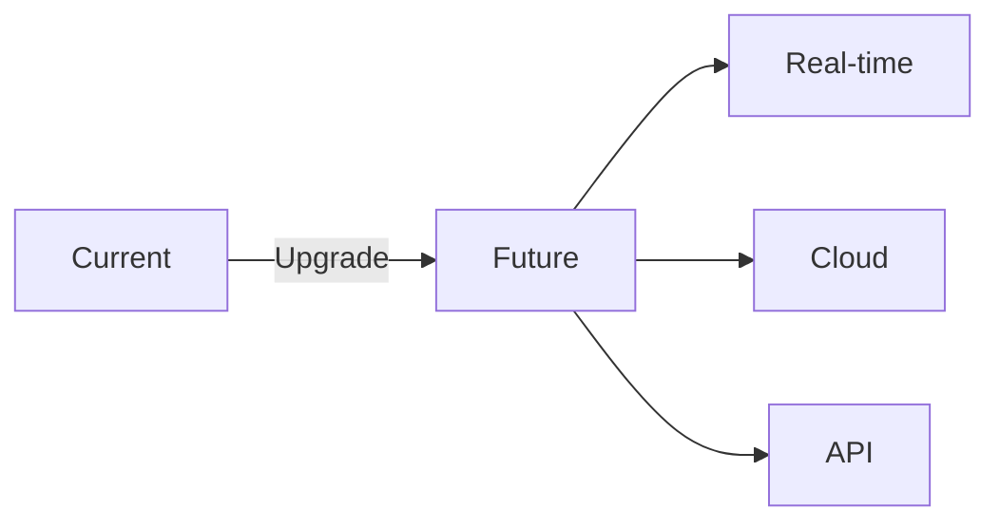

<div align="center">

# 🏗️ NinjaNotes Architecture
> Technical Design & System Architecture


</div>

## 🔍 System Overview



## 🧱 Core Components

### 1. Frontend Layer
- **Web Interface**: HTML5, CSS3, JavaScript
- **Real-time Updates**: Server-Sent Events (SSE)
- **Progress Tracking**: Dynamic status updates
- **Responsive Design**: Mobile-friendly layout

### 2. Backend Server
- **Framework**: Flask 2.0+
- **Routing**: RESTful API endpoints
- **File Handling**: Secure upload management
- **Error Handling**: Comprehensive error capture

### 3. Audio Processing
- **Tool**: FFmpeg
- **Operations**:
  - Format validation
  - Audio conversion
  - Quality checks
  - Size management

### 4. AI Models
- **Speech Recognition**:
  ```python
  model = whisper.load_model("base")
  result = model.transcribe(audio_file)
  ```
- **Summarization**:
  ```python
  summarizer = pipeline("summarization", model="facebook/bart-large-cnn")
  summary = summarizer(text, max_length=130)
  ```

## 📡 Data Flow

1. **Input Stage**
   ```
   Client → Upload → Validation → Storage
   ```

2. **Processing Stage**
   ```
   Audio → FFmpeg → Whisper → Text
   ```

3. **AI Stage**
   ```
   Text → BART → Summary
   ```

4. **Output Stage**
   ```
   Results → Client → Display
   ```

## 🔐 Security Measures

- File validation
- Size limits
- Format checks
- Error handling
- Secure file storage

## 💾 Storage Management

```
uploads/
├── temp/           # Temporary storage
├── processed/      # Processed files
└── archive/       # Backup storage
```

## 📊 Performance

| Component | Average Time | Memory Usage |
|-----------|--------------|--------------|
| Upload | 1-2s | Variable |
| FFmpeg | 2-3s | ~100MB |
| Whisper | 10-15s | ~1GB |
| BART | 2-3s | ~1.5GB |

## 🔄 Workflow



## 🛠️ Technical Requirements

- Python 3.8+
- FFmpeg
- 4GB RAM
- CUDA (optional)
- Modern web browser

## 📈 Scalability

- Modular design
- Async processing
- Queue management
- Resource optimization

## 🔮 Future Architecture



## 📚 Documentation

- [API Guide](API.md)
- [Model Details](AI_MODELS.md)
- [Setup Guide](INSTALLATION.md)
