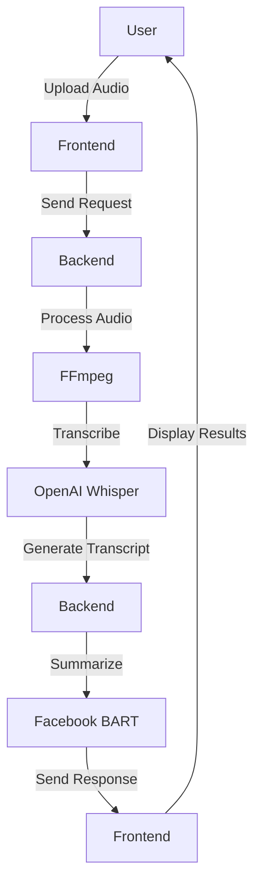
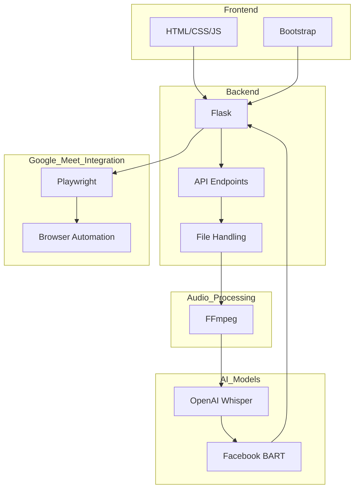

# 🏗️ NinjaNotes Architecture

## System Architecture

### Overview
NinjaNotes is an AI-powered meeting assistant that automates the process of joining, recording, transcribing, and summarizing Google Meet sessions. The system leverages various AI/ML models and tools to achieve its functionality.

### Components
1. **Frontend**: The user interface built with HTML, CSS, and JavaScript, providing an intuitive way for users to interact with the system.
2. **Backend**: A Flask-based server that handles requests, processes audio files, and manages interactions with Google Meet.
3. **AI Models**: 
   - **OpenAI Whisper**: For speech-to-text transcription.
   - **Facebook BART**: For text summarization.
4. **Google Meet Integration**: Uses Playwright for browser automation to join and record meetings.
5. **FFmpeg**: For audio processing and conversion.

### Flow Chart

### Detailed Architecture

### Data Flow
1. **User Interaction**: The user uploads an audio file or provides a Google Meet link via the frontend interface.
2. **Request Handling**: The frontend sends the request to the backend server.
3. **Audio Processing**: The backend uses FFmpeg to process the audio file.
4. **Transcription**: The processed audio is transcribed using the OpenAI Whisper model.
5. **Summarization**: The transcript is summarized using the Facebook BART model.
6. **Response**: The backend sends the transcript and summary back to the frontend.
7. **Display**: The frontend displays the results to the user.

### Technologies Used
- **Flask**: Web framework for the backend.
- **Playwright**: Browser automation for Google Meet integration.
- **Whisper**: Speech-to-text model for transcription.
- **BART**: Text summarization model.
- **Bootstrap**: UI styling for the frontend.
- **FFmpeg**: Audio processing tool.

### Deployment
- **Local Environment**: The application can be run locally for development and testing.
- **Production Environment**: The application can be deployed on a cloud platform for production use.

### Future Enhancements
- **Real-time Transcription**: Implement real-time transcription for live meetings.
- **Multi-language Support**: Extend support for multiple languages in transcription and summarization.
- **Advanced Analytics**: Provide advanced analytics and insights from meeting transcripts.
