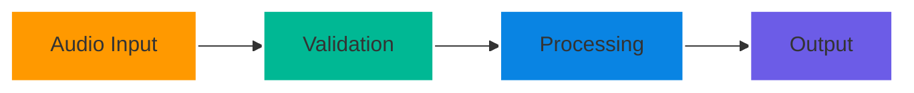
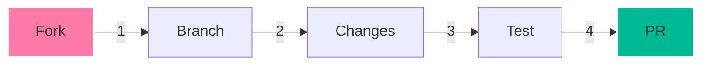

<div align="center">

# 🎯 NinjaNotes

[](https://www.python.org)
[](https://flask.palletsprojects.com/)
[](https://ffmpeg.org)
[](LICENSE)

> 🎙️ Transform Audio to Intelligence: Automated Transcription & Summarization

[Quick Start](#quick-start) • [Features](#features) • [Installation](#installation) • [Documentation](#documentation)


</div>

---

## ⚡ Quick Start

```bash
git clone https://github.com/ankita1477/ninjanotes.git && cd ninjanotes
python -m venv venv && source venv/bin/activate
pip install -r requirements.txt && python app.py
```

🌐 Open [http://localhost:5000](http://localhost:5000)

## 🌟 Features

<table>
<tr>
<td width="50%">

### 🎙️ Audio Processing
- Multi-format Support
  - MP3, WAV, M4A, OGG
- Real-time Processing
- Automatic Format Conversion
- Quality Validation

</td>
<td width="50%">

### 🤖 AI Capabilities
- Speech Recognition
  - 85-95% Accuracy
  - Noise Handling
- Smart Summarization
  - Key Point Extraction
  - Context Awareness

</td>
</tr>
<tr>
<td width="50%">

### 📊 Progress Tracking
- Real-time Status Updates
- Stage-wise Monitoring
- Error Notifications
- Process Analytics

</td>
<td width="50%">

### 🛠️ Developer Features
- RESTful API
- Error Handling
- Progress Streaming
- Easy Integration

</td>
</tr>
</table>

## 📚 Documentation

### API Endpoints

| Endpoint | Method | Description | Example |
|----------|--------|-------------|---------|
| `/` | GET | Web Interface | [Try It](http://localhost:5000) |
| `/process` | POST | Process Audio | `curl -F "file=@audio.mp3"` |
| `/progress` | GET | Track Progress | Server-Sent Events |
| `/model-status` | GET | AI Status | JSON Response |

### File Support



## 💻 Installation

<details>
<summary>Click to expand installation steps</summary>

### Prerequisites
- Python 3.8+
- FFmpeg
- 4GB RAM
- Modern Browser

### Detailed Steps
See [INSTALLATION.md](INSTALLATION.md)
</details>

## 🚀 Usage

1. **Start Server**
   ```bash
   python app.py
   ```

2. **Upload Audio**
   - Drag & drop file
   - Or click upload button
   - Supported: MP3, WAV, M4A, OGG

3. **Monitor Progress**
   - Watch real-time updates
   - Check processing stages
   - View final results

## 🔧 Troubleshooting

<details>
<summary>Common Issues</summary>

| Issue | Quick Fix | Details |
|-------|-----------|----------|
| FFmpeg Missing | [Install FFmpeg](INSTALLATION.md#2-install-ffmpeg) | Required for audio processing |
| Upload Fails | Check file size (<16MB) | Size limit: 16MB |
| Port Busy | Change port in app.py | Default: 5000 |
| Memory Error | Free up RAM | Need: 4GB+ |

</details>

## 🤝 Contributing



## 📄 License

MIT © [ankita1477](https://github.com/ankita1477)

---

<div align="center">

Made with ❤️ by [ankita1477](https://github.com/ankita1477)

[🔝 Back to Top](#)

</div>
