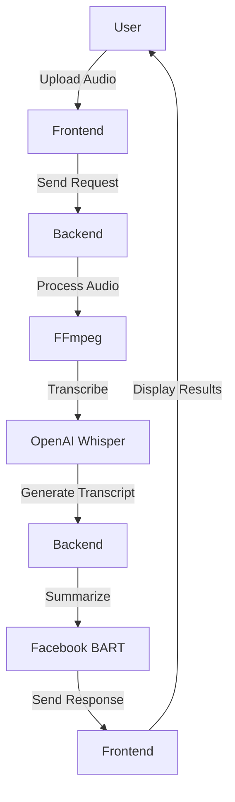
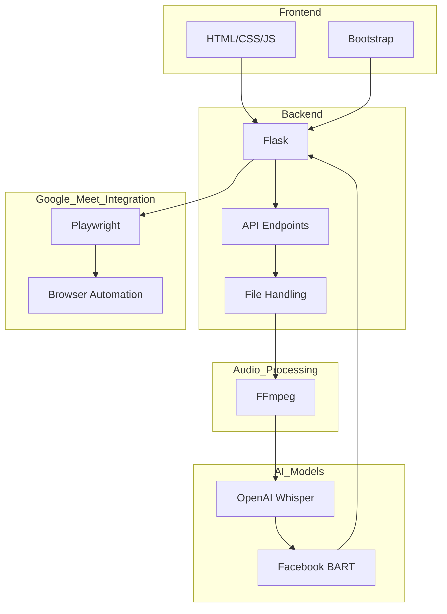

# 🎯 NinjaNotes - AI-Powered Meeting Assistant

Automatically join, record, transcribe, and summarize Google Meet sessions with AI intelligence.

## ✨ Key Features

- 🤖 AI-Powered Audio Processing
- 🎥 Automatic Google Meet Joining
- 🎙️ Smart Meeting Recording
- 📝 Real-time Transcription
- ✨ Intelligent Summarization
- 📊 Multiple Format Support (MP3, WAV, M4A, OGG)

## 🧠 AI Models

### OpenAI Whisper (Speech-to-Text)
- Model Size: Base (1GB)
- Accuracy: 85-95%
- Speed: Real-time processing
- Features:
  - Multilingual support
  - Punctuation & formatting
  - Background noise handling

### Facebook BART (Summarization)
- Model: facebook/bart-large-cnn
- Accuracy: 90%+
- Processing: <2s per text
- Features:
  - Smart meeting summarization
  - Key point extraction
  - Length control (30-130 words)

## 🚀 Quick Start

### 1. Prerequisites

- Python 3.8+
- FFmpeg
- Chrome/Chromium browser

### 2. Clone the repository
```bash
git clone https://github.com/yourusername/ninjanotes.git
cd ninjanotes
```

### 3. Install FFmpeg
- Download FFmpeg essentials build
- Extract to C:\ffmpeg-7.1-essentials_build
- Add bin directory to PATH

### 4. Set up Python environment
```bash
python -m venv venv
source venv/bin/activate  # On Windows: venv\Scripts\activate
pip install -r requirements.txt
playwright install
```

### 5. Create required directories
```bash
mkdir uploads
```

### 6. Run the application
```bash
python app.py
```

7. Open `http://localhost:5000` in your browser

## Usage

### Recording Google Meet Sessions

1. Start the application
2. Enter Google Meet link in the interface
3. Click "Join & Record"
4. Wait for automatic joining and recording
5. Click "Leave Meeting" when done

### Processing Audio Files

1. Upload supported audio file
2. Click "Process Audio"
3. View transcript and summary

## Project Structure

```
ninjanotes/
├── app.py             # Main Flask application
├── requirements.txt   # Python dependencies
├── uploads/          # Temporary audio storage
├── templates/        # HTML templates
│   └── index.html    # Main interface
└── README.md         # This file
```

## Technologies Used

- **Flask**: Web framework
- **Playwright**: Browser automation
- **Whisper**: Speech-to-text
- **BART**: Text summarization
- **Bootstrap**: UI styling

## Troubleshooting

### Common Issues

1. **FFmpeg not found**
   - Ensure FFmpeg is installed in the correct location
   - Check system PATH includes FFmpeg bin directory

2. **Audio recording issues**
   - Check microphone permissions
   - Verify sound input device is working

3. **Meet joining fails**
   - Check internet connection
   - Verify Meet link format
   - Ensure browser permissions are granted

## Contributing

1. Fork the repository
2. Create feature branch
3. Commit changes
4. Push to branch
5. Create Pull Request

## License

MIT License - feel free to use for any purpose.

## Acknowledgments

- OpenAI Whisper for transcription
- Facebook BART for summarization
- Microsoft Playwright for automation


# 🏗️ NinjaNotes Architecture

## System Architecture

### Overview
NinjaNotes is an AI-powered meeting assistant that automates the process of joining, recording, transcribing, and summarizing Google Meet sessions. The system leverages various AI/ML models and tools to achieve its functionality.

### Components
1. **Frontend**: The user interface built with HTML, CSS, and JavaScript, providing an intuitive way for users to interact with the system.
2. **Backend**: A Flask-based server that handles requests, processes audio files, and manages interactions with Google Meet.
3. **AI Models**: 
   - **OpenAI Whisper**: For speech-to-text transcription.
   - **Facebook BART**: For text summarization.
4. **Google Meet Integration**: Uses Playwright for browser automation to join and record meetings.
5. **FFmpeg**: For audio processing and conversion.

### Flow Chart


### Detailed Architecture


### Data Flow
1. **User Interaction**: The user uploads an audio file or provides a Google Meet link via the frontend interface.
2. **Request Handling**: The frontend sends the request to the backend server.
3. **Audio Processing**: The backend uses FFmpeg to process the audio file.
4. **Transcription**: The processed audio is transcribed using the OpenAI Whisper model.
5. **Summarization**: The transcript is summarized using the Facebook BART model.
6. **Response**: The backend sends the transcript and summary back to the frontend.
7. **Display**: The frontend displays the results to the user.

### Technologies Used
- **Flask**: Web framework for the backend.
- **Playwright**: Browser automation for Google Meet integration.
- **Whisper**: Speech-to-text model for transcription.
- **BART**: Text summarization model.
- **Bootstrap**: UI styling for the frontend.
- **FFmpeg**: Audio processing tool.

### Deployment
- **Local Environment**: The application can be run locally for development and testing.
- **Production Environment**: The application can be deployed on a cloud platform for production use.

### Future Enhancements
- **Real-time Transcription**: Implement real-time transcription for live meetings.
- **Multi-language Support**: Extend support for multiple languages in transcription and summarization.
- **Advanced Analytics**: Provide advanced analytics and insights from meeting transcripts.
