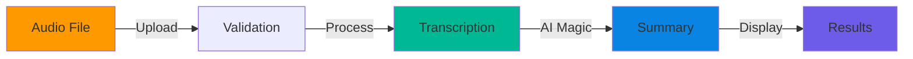

<div align="center">

# 🎯 NinjaNotes

[](https://www.python.org)
[](https://github.com/ankita1477)

> Transform Speech to Insights with AI Magic ✨

[Live Demo](http://localhost:5000) • [Documentation](#-documentation) • [Quick Start](#-quick-start) • [API Guide](#-api-guide)

<kbd>
  
</kbd>

</div>

---

<details open>
<summary>📋 Table of Contents</summary>

- [🚀 Quick Start](#-quick-start)
- [✨ Features](#-features)
- [🛠️ Installation](INSTALLATION.md)
- [📚 Documentation](#-documentation)
- [🔧 Troubleshooting](#-troubleshooting)
- [🤝 Contributing](#-contributing)

</details>

## 🎭 Overview

NinjaNotes is your AI-powered audio processing companion that:
- 🎙️ **Processes** multiple audio formats
- 📝 **Transcribes** speech with high accuracy
- ✨ **Summarizes** content intelligently
- 📊 **Tracks** progress in real-time

<div align="center">



</div>

## ⚡ SETUP IN 3 STEPS
> 👉 For detailed installation instructions, [click here](INSTALLATION.md)

<table>
<tr>
<td width="33%" align="center">

### 1. Prerequisites
- Python 3.8+
- FFmpeg
- Git

</td>
<td width="33%" align="center">

### 2. One-Line Install
```bash
git clone https://github.com/ankita1477/ninjanotes.git && cd ninjanotes && python -m venv venv && source venv/bin/activate && pip install -r requirements.txt && python app.py
```

</td>
<td width="33%" align="center">

### 3. Verify
Open in browser:
http://localhost:5000

</td>
</tr>
</table>

[📚 Detailed Setup Guide](SETUP.md) • [🔧 Troubleshooting](SETUP.md#-troubleshooting)

## 🎨 Features Matrix

<table>
<tr>
<td width="25%" align="center">

### 🎵 Audio Support
- MP3
- WAV
- M4A
- OGG

</td>
<td width="25%" align="center">

### 🤖 AI Models
- Whisper
- BART
- Real-time

</td>
<td width="25%" align="center">

### 📊 Analytics
- Progress
- Status
- Metrics

</td>
<td width="25%" align="center">

### 🛡️ Security
- Validation
- Size Limits
- Error Handling

</td>
</tr>
</table>

## 📚 API Guide

### Endpoints Overview

```javascript
GET  /              // Web Interface
POST /process       // Process Audio
GET  /progress      // Track Status
GET  /model-status  // AI Status
```

### Example Usage

```bash
# Upload audio file
curl -X POST http://localhost:5000/process \
  -F "file=@your-audio.mp3"

# Monitor progress
curl http://localhost:5000/progress
```

## 💻 Development

<table>
<tr>
<td width="50%">

### 🏗️ Project Structure
```
ninjanotes/
├── app.py          # Core Application
├── static/         # Assets
├── templates/      # Views
├── uploads/        # Storage
└── models/         # AI Models
```

</td>
<td width="50%">

### 🔧 Tech Stack
- Flask (Backend)
- Whisper (Speech-to-Text)
- BART (Summarization)
- FFmpeg (Audio Processing)

</td>
</tr>
</table>

## 🚨 Troubleshooting

<details>
<summary>Common Issues & Solutions</summary>

| Problem | Solution | Code |
|---------|----------|------|
| FFmpeg Missing | Install FFmpeg | `brew install ffmpeg` |
| Port in Use | Change Port | `app.run(port=5001)` |
| Memory Error | Increase RAM | `export MAX_MEMORY=8G` |

</details>

## 🌟 Contributing

We welcome contributions! See our [Contributing Guide](CONTRIBUTING.md).

<div align="center">

[](https://star-history.com/#ankita1477/ninjanotes&Timeline)

---

Made with 🧡 by [ankita1477](https://github.com/ankita1477)

</div>
