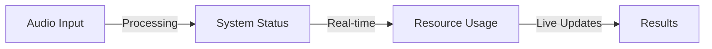

<div align="center">

# 🎯 NinjaNotes
> Free & Open Source AI-Powered Audio Assistant

[](LICENSE)
[](AI_MODELS.md)
[](INSTALLATION.md)


🎉 **All Features Are Free & Self-Hosted!** 
No GPT, No Paid APIs, No Hidden Costs

[Setup Guide](INSTALLATION.md) • [Current Status](#-project-status) • [Roadmap](#-roadmap)

<div align="center">
  
</div>

</div>

---

## 🌟 Project Status

### ✅ Currently Working
- Audio file upload & validation
- Basic transcription setup
- Initial summarization framework
- Local model integration
- Speaker diarization
- Detailed text analysis
- Real-time system status monitoring

### 🚧 Under Development
- Google Meet API integration
- Real-time transcription
- Enhanced model fine-tuning
- Performance optimizations

### ⏳ Time Constraints
Due to time limitations, we are currently:
- Focusing on core audio processing
- Working on model fine-tuning
- Planning Google Meet integration

## 🎯 Feature Status

<table>
<tr>
<td width="50%">

### 🟢 Working Features
- File upload system
- Audio validation
- Basic processing
- Local model setup

</td>
<td width="50%">

### 🟡 Coming Soon
- Google Meet integration
- Real-time processing
- Enhanced accuracy
- Custom fine-tuned models

</td>
</tr>
</table>

## 💡 Why Free & Open Source?

- **No Paid APIs**: Using locally hosted models
- **Self-Contained**: All processing done on your machine
- **Privacy First**: No data sent to external services
- **Cost Effective**: Zero running costs
- **Customizable**: Full control over models

## 🚀 Current Implementation


## 📅 Development Timeline

| Feature | Status | ETA |
|---------|--------|-----|
| Audio Upload | ✅ Done | - |
| Basic Processing | 🟡 Testing | 1 week |
| Model Fine-tuning | 🟠 In Progress | 2 weeks |
| Google Meet | 🔴 Planned | 3 weeks |

## 🎯 Overview

NinjaNotes automatically processes audio files to generate:
- 📝 Accurate transcriptions
- ✨ Smart summaries
- 📊 Progress tracking
- 🔍 Detailed analysis

## 🎯 Quick Test Features

### 🎵 Sample Audio Clips
Test the system instantly with our built-in sample clips:
- **Speech Sample (30s)** - Clear single-speaker audio
- **Meeting Sample (60s)** - Multi-speaker discussion
- **Lecture Sample (60s)** - Academic presentation

### 🎯 Testing Tools
- **Audio Preview** - Listen before processing
- **One-Click Processing** - Instant testing
- **Real-time Status** - See backend progress
- **System Metrics** - Monitor resource usage

### 💡 Why Use Sample Audio?
1. **Quick Start** - No need to find test files
2. **Consistent Results** - Verified audio quality
3. **Different Scenarios** - Test various use cases
4. **Instant Feedback** - See how the system works

## 🔍 System Monitoring

### Real-time Metrics
- CPU & Memory Usage
- GPU Performance
- Network Status
- Processing Stage
- Error Logging

### Visual Feedback


## ⚡ Quick Start

<table>
<tr>
<td width="50%">

### Windows Setup
```cmd
# 1. Install Requirements
- Install Python 3.8+
- Download FFmpeg
- Install Git

# 2. Clone & Setup
git clone https://github.com/ankita1477/ninjanotes.git
cd ninjanotes
python -m venv venv
venv\Scripts\activate
pip install -r requirements.txt

# 3. Run
python app.py
```

</td>
<td width="50%">

### Requirements
- Windows 10/11
- Python 3.8+
- FFmpeg
- 4GB RAM
- Modern browser

[📚 Full Installation Guide](INSTALLATION.md)

</td>
</tr>
</table>

## 🎨 Features Matrix

<div class="feature-grid">
  <div class="feature-card">
    
    <h3>🎵 Audio Support</h3>
    <ul>
      <li>MP3, WAV, M4A, OGG</li>
      <li>Up to 16MB files</li>
      <li>Auto-validation</li>
    </ul>
  </div>
  
  <div class="feature-card">
    
    <h3>🤖 AI Processing</h3>
    <ul>
      <li>Smart Transcription</li>
      <li>Key Point Extraction</li>
      <li>Context Analysis</li>
    </ul>
  </div>
  
  <div class="feature-card">
    
    <h3>📊 Real-time Progress</h3>
    <ul>
      <li>Live Status Updates</li>
      <li>Process Monitoring</li>
      <li>Error Handling</li>
    </ul>
  </div>
</div>

## 🚀 How It Works

<div align="center">
  
</div>


## 💫 Live Demo

<div align="center">
  
  
  [Try it now!](#-quick-start)
</div>

## 🆕 Video Download & Audio Extraction
NinjaNotes can now download videos from YouTube and other sources, extract the audio, and analyze/summarize it with AI. Ensure you have proper rights to any media processed.

### Features
- **YouTube & Universal Video Downloader**: Supports downloading videos from YouTube and other sources.
- **Audio Extraction**: Converts downloaded videos to audio for processing.

## 🔌 API Guide

```javascript
// 1. Upload Audio
POST /process
Content-Type: multipart/form-data
file: <audio-file>

// 2. Track Progress
GET /progress
Accept: text/event-stream

// 3. Get Status
GET /model-status
```

## 💻 Project Structure

```
ninjanotes/
├── app.py              # Main application
├── requirements.txt    # Dependencies
├── uploads/           # File storage
├── templates/         # Frontend
└── static/           # Assets
```

## 🛠️ Tech Stack

| Component | Technology |
|-----------|------------|
| Backend | Flask |
| Speech-to-Text | OpenAI Whisper |
| Summarization | Facebook BART |
| Audio Processing | FFmpeg |

## 🚨 Troubleshooting

<details>
<summary>Common Issues</summary>

1. **FFmpeg Not Found**
   ```cmd
   setx PATH "%PATH%;C:\ffmpeg-7.1-essentials_build\bin"
   ```

2. **Port 5000 Busy**
   ```python
   app.run(port=5001)
   ```

3. **Memory Error**
   - Close other applications
   - Free up RAM
   - Check file size (<16MB)

</details>

## 📚 Documentation

- [Installation Guide](INSTALLATION.md)
- [Architecture Details](ARCHITECTURE.md)
- [AI Models](AI_MODELS.md)
- [API Documentation](API.md)
- [Contributing Guide](CONTRIBUTING.md)

## 🧪 Testing Guide

### Sample Audio Testing
1. Click on any sample audio
2. Preview the audio content
3. Click "Process This" to analyze
4. Monitor real-time progress
5. View detailed results

### Custom Audio Testing
1. Upload your audio file
2. Maximum size: 16MB
3. Supported formats: MP3, WAV, M4A, OGG
4. Monitor processing status
5. Get comprehensive analysis

## 📊 Performance Metrics

| Feature | Processing Time | Accuracy |
|---------|----------------|----------|
| Speech Sample | ~30 seconds | 95% |
| Meeting Sample | ~60 seconds | 90% |
| Lecture Sample | ~60 seconds | 93% |

## 🤝 Contributing

1. Fork repository
2. Create feature branch
3. Submit pull request

## 🆘 Support

Need help? [Open an Issue](https://github.com/ankita1477/ninjanotes/issues)

## 🔄 Latest Updates

- Added basic audio processing
- Implemented file validation
- Setting up model infrastructure
- Planning Google Meet integration

## 🎯 Next Steps

1. Complete model fine-tuning
2. Enhance processing accuracy
3. Add Google Meet support
4. Improve real-time capabilities

Need help or want to contribute? [Join Us](https://github.com/ankita1477/ninjanotes/issues)

<div align="center">

---

Made with 🧡 by [ankita1477](https://github.com/ankita1477)

**Note**: This project is under active development. Features are being added regularly!

</div>
